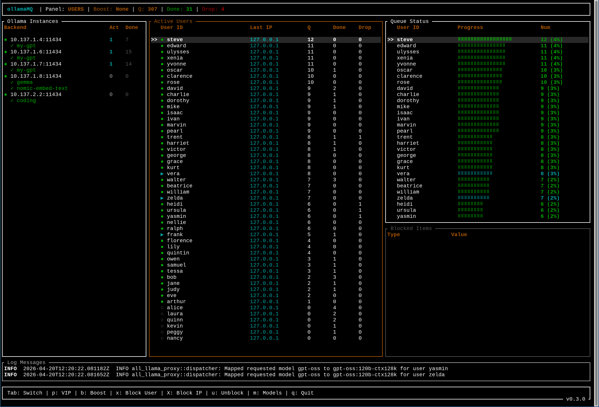

# all-llama-proxy

`all-lama-proxy` is a high-performance, asynchronous message queue dispatcher and load balancer designed to sit in front of one or more [Ollama](https://ollama.ai/) API instances. It acts as a smart proxy that queues incoming requests from multiple users and dispatches them in parallel to multiple Ollama backends using a fair-share round-robin scheduler with least-connections load balancing.

`all-lama-proxy` is a fork of the awesome [`ollamaMQ`](https://github.com/Chleba/ollamaMQ) project. This project adds authentication and replaces Docker with a systemd service as the intended deployment method.


## 🚀 Features

- **Multi-Backend Load Balancing**: Distribute requests across multiple Ollama instances using a **Least Connections + Round Robin** strategy.
- **Parallel Processing**: Unlike basic proxies, `all-llama-proxy` can process multiple requests simultaneously (one per available backend), significantly increasing throughput for multiple users.
- **Backend Health Checks**: Automatically monitors backend status every 10 seconds; offline instances are temporarily skipped and marked in the TUI.
- **Config Reload**: reload the config with a SIGHUP signal without restarting the service.
- **Authentication**: A simple user database that allows adding SHA256 sums of access tokens.
- **Per-User Queuing**: Each user (identified by the `X-User-ID` header) has their own FIFO queue.
- **Fair-Share Scheduling**: Prevents any single user from monopolizing all available backends.
- **Transparent Header Forwarding**: Full support for all HTTP headers (including `X-User-ID`) passed to and from Ollama, ensuring compatibility with tools like **Claude Code**.
- **VIP Mode**: High priority (VIP) for specific users.
- **Real-Time TUI Dashboard**: Monitor backend health, active requests, queue depths, and throughput in real-time.
- **OpenAI Compatibility**: Supports standard OpenAI-compatible endpoints.
- **Async Architecture**: Built on `tokio` and `axum` for high concurrency.
- **Model Aliases**: Support model aliases to map legacy model requests & allow renaming models.



## 🛠️ Installation

Ensure you have [Rust](https://rustup.rs/) (2024 edition or later) and [Ollama](https://ollama.ai/) installed.

### Download Binary

Go to the [releases section](https://github.com/netzbegruenung/all-llama-proxy/releases) and fetch the latest binary. Currently only available for x86_64.

### Install from Source

1. Clone the repository:

   ```bash
   git clone https://github.com/Chleba/all-llama-proxy.git
   cd all-llama-proxy
   ```

2. Build and install locally:
   ```bash
   cargo install --path .
   ```

## 🏃 Usage

### Command Line Arguments

`all-llama-proxy` supports several options to configure the proxy:

- `--models-config-path`: path to the model configuration file (default: `/etc/all-llama-proxy/models.yaml`)
- `--users-path`: path to the users config file (default: `/etc/all-llama-proxy/users.yaml`)
- `--bind <INTERFACE:PORT>`: Interface and port to listen on (default: `127.0.0.1:11435`)
- `-t, --timeout <SECONDS>`: Request timeout in seconds (default: `300`)
- `--allow-all-routes`: Enable fallback proxy for non-standard endpoints
- `-i, --ip-header`: trusted source IP header, useful behind proxy for TLS offloading
- `-h, --help`: Print help message
- `-V, --version`: Print version information
- `--debug`: print debug messages to log file

**Example:**

```bash
all-llama-proxy --bind 127.0.0.1:8080 --models-config-path ./example/models.yaml --users-path ./texample/users.yaml
```

To start the TUI, execute `all-llama-tui`.

### Add new User to `users.yaml`

1. First generate a seecret token (with your password manager)

1. Create a SHA256 hash of the token:

   ```bash
   echo -n "SECRET_TOKEN" | sha256sum
   ```

1. Add a new entry to the users.yaml:

   ```yaml
   users:
   - token_hash: REPLACE_WITH_HASH
     user_id: REPLACE_WITH_USER_ID
   ```

### API Proxying

Point your LLM clients to the `all-llama-proxy` port (`11435`) and include the `X-User-ID` header.

#### Supported Endpoints:

- `GET /health` (Internal health check)
- `GET /` (Ollama Status)
- `POST /api/generate`
- `POST /api/chat`
- `POST /api/embed`
- `POST /api/embeddings`
- `GET /api/tags`
- `POST /api/show`
- `POST /api/create`
- `POST /api/copy`
- `DELETE /api/delete`
- `POST /api/pull`
- `POST /api/push`
- `GET/HEAD/POST /api/blobs/{digest}`
- `GET /api/ps`
- `GET /api/version`
- `POST /v1/chat/completions` (OpenAI Compatible)
- `POST /v1/completions` (OpenAI Compatible)
- `POST /v1/embeddings` (OpenAI Compatible)
- `GET /v1/models` (OpenAI Compatible)
- `GET /v1/models/{model}` (OpenAI Compatible)


#### Example (cURL):

```bash
curl -X POST http://localhost:11435/api/chat \
  -H "Authorization: Bearer SECRET" \
  -H "X-User-ID: developer-1" \
  -d '{
    "model": "qwen3.5:35b",
    "messages": [{"role": "user", "content": "Explain quantum computing."}],
    "stream": true
  }'
```

### Dashboard Controls

The interactive TUI dashboard provides a live view of the dispatcher's state:

- **`j` / `k`** or **Arrows**: Navigate the user/blocked list.
- **`Tab`** or **`h` / `l`**: Switch between the Users and Blocked panels.
- **`p`**: Toggle **VIP** status for the selected user (priority over non-VIP users).
- **`x`**: Block the selected user.
- **`X`**: Block the selected user's IP address.
- **`u`**: Unblock the selected user or IP (works in both panels).
- **`q`** or **Esc**: Exit the dashboard and stop the application.
- **`?`**: Toggle detailed help.

**Visual Indicators:**
- `★` (Magenta): **VIP User** (priority).
- `▶` (Cyan): Request is currently being processed/streamed.
- `●` (Green): User has requests waiting in the queue.
- `○` (Gray): User is idle (no active or queued requests).
- `✖` (Red): User or IP is blocked.

## 🏗️ Architecture

- **`src/main.rs`**: Entry point handling CLI parsing, HTTP server initialization, model config loading from `models.yaml`, user registry from `users.yaml`, and TUI lifecycle management.
- **`src/dispatcher.rs`**: Core dispatch engine with model-to-backend routing, fair-share per-user queuing, least-connections load balancing, and background health monitoring.
- **`src/auth.ts`**: Populates the users regitry from the `users.yaml` config.
- **`src/tui.rs`**: Real-time dashboard displaying backend status, per-user queue depths, processed counts, and model visibility using public names from config.

### Configuration Files

- **`models.yaml`**: Explicit model-to-backend mappings with optional `public_name` for display names (separates routing from presentation).
- **`users.yaml`**: User database with SHA256-hashed tokens and optional VIP flag per user.

### Request Flow

1. Client sends request with `X-User-ID` header.
2. Authentication via SHA256 token hash lookup; VIP status from config (can be toggled in TUI).
3. Request placed in user-specific FIFO queue.
4. Worker selects next user via fair-share scheduling (VIP first, then round-robin).
5. Available backend selected (online, not busy, matching model config).
6. Task spawned: request proxied to backend with transparent header passthrough.
7. Response streamed to client; backend freed for next task.

## 🧪 Development

### Stress Testing

You can use the provided `test_dispatcher.sh` script to simulate multiple users and verify the dispatcher's behavior under load:

```bash
./test_dispatcher.sh
```


## 📝 License

This project is licensed under the MIT License - see the [LICENSE](LICENSE) file for details (if applicable).
